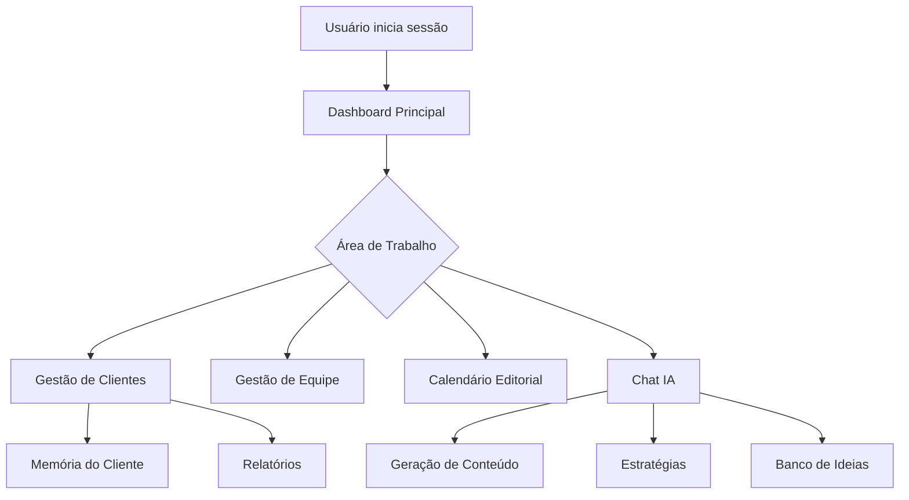

# KeepAI

KeepAI é uma plataforma inteligente para agências de marketing digital, focada em otimizar fluxos de trabalho e aumentar a produtividade através de IA.

## Funcionalidades

### Para Donos de Agência

- 👥 **Gestão de Equipe**: Gerencie funcionários e suas atribuições
- 🏢 **Gestão de Clientes**: Organize sua carteira de clientes
- 📊 **Dashboard**: Métricas e KPIs importantes
- 📈 **Relatórios**: Acompanhamento de performance

### Para Funcionários

- 📝 **Memória do Cliente**: Documentação estruturada do contexto do cliente
- 🤖 **Chat IA**: Assistente inteligente para estratégias
- ✨ **Gerador de Conteúdo**: Posts, blogs e campanhas otimizadas
- 📅 **Calendário Editorial**: Organize publicações e campanhas
- 🎯 **Banco de Ideias**: Armazene e organize insights criativos

### Recursos Gerais

- 📝 **Notas**: Crie e organize suas notas com suporte a markdown
- ✅ **Tarefas**: Gerencie suas tarefas com listas personalizadas
- 📅 **Calendário**: Organize seus eventos e compromissos
- 🤖 **IA**: Assistente inteligente para ajudar em suas atividades
- 🔄 **Sincronização**: Seus dados sempre atualizados em todos os dispositivos

## Arquitetura

Este projeto utiliza uma arquitetura desacoplada (Decoupled Architecture) com duas camadas principais:

### Backend (API) - FastAPI

- Responsável pela lógica de negócios e dados
- API REST com FastAPI
- Validação automática com Pydantic
- Documentação automática (Swagger/OpenAPI)
- Suporte assíncrono nativo

### Frontend (Web) - Flask

- Interface do usuário e renderização de templates
- Gerenciamento de sessões
- Templates Jinja2
- Integração com a API via httpx

## Tecnologias

- **Backend**:

  - Python 3.11
  - FastAPI (Framework em Python)
  - Supabase (Banco de Dados)
  - Clerk (Autenticação)
  - JWT (Tokens de Acesso)
  - Gunicorn (Servidor WSGI)
  - Google Gemini (IA)
  - LangChain (Framework de IA)

- **Frontend**:
  - Jinja2 Templates
  - HTML5 & CSS3
  - JavaScript (ES6+)
  - Bootstrap 5
  - FullCalendar

## Requisitos

- Python 3.11+
- Docker e Docker Compose
- Conta no Supabase
- Conta no Clerk

## Configuração

1. Clone o repositório:

```bash
git clone https://github.com/seu-usuario/keepai.git
cd keepai
```

2. Configure o ambiente:
   Posteriomente passarei instrucões para configurar o ambiente

3. Inicie o container:

```bash
docker compose up -d
```

4. Acesse o aplicativo em `http://localhost:5001`

## Scripts Utilitários

### Configurar URLs do Supabase

```bash
python 00_core/04_scripts/setup_env.py
```

Configura as URLs necessárias para conexão com o Supabase:

- `DATABASE_URL`: Conexão direta para a aplicação
- `SUPABASE_DB_URL`: Alias para scripts de migração

### Migrações do Banco de Dados

Para executar e testar as migrações, use o Jupyter Notebook:

1. Instale as dependências:

```bash
pip install jupyter notebook pandas numpy matplotlib seaborn
```

2. Inicie o Jupyter:

```bash
jupyter notebook  # Acesse em http://localhost:8888/tree
```

3. Abra o notebook `00_core/02_notebooks/01_test_migrations.ipynb`

O notebook usa LangChain + Gemini Pro para:

- Executar as migrações em ordem
- Verificar se cada migração foi bem sucedida
- Validar o estado final do banco
- Fornecer feedback em linguagem natural

## Desenvolvimento

1. Instale as dependências:

```bash
pip install -r requirements.txt
```

2. Execute os testes:

```bash
pytest
```

3. Verifique o estilo do código:

```bash
flake8
black .
mypy .
```

## Estrutura do Projeto

- [EC_estrutura_core.md](00_core/EC_estrutura_core.md)
- [EC_estrutura_server.md](server/EC_estrutura_server.md)

## FLUXO DE TRABALHO

### Fluxo do Usuário



### Interação com IA

1. **Chat Inteligente**

   - Análise de briefings
   - Sugestões de estratégias
   - Otimização de conteúdo

2. **Automações**

   - Geração de relatórios
   - Calendário editorial
   - Insights de performance

3. **Gestão de Conhecimento**
   - Documentação automática
   - Base de conhecimento
   - Histórico de interações

## Viabilidade Técnica

1. O projeto está preparado para implementar este fluxo pois já possui:

- Estrutura Base
- LangChain configurado (linhas 47-54 em server/EC_estrutura_server.md)
- Modelos de dados flexíveis
- API REST robusta

2. Componentes Necessários

- Supabase para persistência
- FastAPI para endpoints
- Gemini Pro para IA
- Templates prontos

3. Integrações Possíveis

- Clerk para autenticação
- FullCalendar para agenda
- Markdown para notas
- WebSockets para real-time

## Próximos Passos

1. Expandir AutonomousNotes

- Adicionar mais ferramentas
- Melhorar contexto
- Implementar workflows

2. Criar Conectores

- Entre notas e tarefas
- Com calendário
- Para documentos

3. Melhorar IA

- Treinar para contextos específicos
- Adicionar memória de longo prazo
- Implementar sugestões proativas

## Licença

Este projeto está licenciado sob a licença MIT - veja o arquivo [LICENSE](LICENSE) para mais detalhes.
